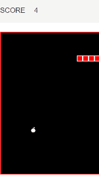

# Snake-Game-using-JavaScript
Snake Game using vanilla JavaScript

The code is well-commented and can be easily edited to customise the look of the game. :snake:

## How it looks

You can try it out on https://amitnayakblr.github.io/Snake-Game-using-JavaScript/

## How to run the project locally
### Requirements
- Java Runtime installed
### To run the game
- download the zip file of the repo or clone the repo
- open 'index.html' on your web browser
- play using the arrow keys
- If you lose, just refresh the page 
